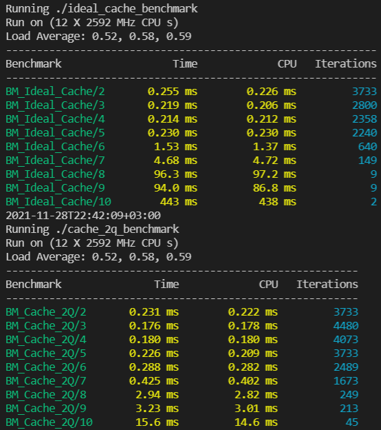

# 2Q Cache and "Ideal" Cache

In this project have been implemented and compared 2Q Cache and "Ideal" Cache (has an array of requested pages before it starts).
The caches' working time have been compared with Google Benchmark

### To build the project the following is needed to be done:

```
mkdir build && cd build/

cmake .. && make

\\or with sanitizers:\\
cmake -DADD-SANITIZERS=1 .. && make

\\or if user has Google Benchmark installed they can try:\\
cmake -DBENCHMARK=1 .. && make

afterwards:

\\to run GoogleTests for either caches:\\
make run_tests_for_caches

\\to run 2Q Cache (note that 2Q Cache works only if cache capacity is greater than 3):\\
make run_cache_2q

\\to run "Ideal" Cache:\\
make run_ideal_cache

\\to use clang format for all *.cpp and *hpp files:\\
make clang_format

\\to run Google Benchmark if installed and -DBENCHMARK=1:\\
make run_caches_benchmark
```

### Google Benchmark for "Ideal" Cache and 2Q Cache respectively:

